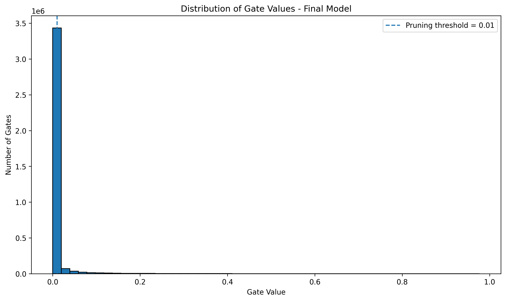

# Self-Pruning Neural Network for CIFAR-10

## Overview

This project implements a self-pruning neural network using learnable
gates and L1-style sparsity regularization.

The model learns:

1. Network weights
2. A learnable gate associated with every weight

The gates determine the effective contribution of individual network
connections.

During training, sparsity regularization encourages unnecessary
connections toward zero. This allows the network to suppress a large
number of connections while maintaining useful classification
performance.

The experiments are performed on the CIFAR-10 image classification
dataset.

---

## Objective

The objective of this project is to investigate whether a neural network
can learn to suppress its own connections during training while
maintaining reasonable classification accuracy.

The project studies the trade-off between:

- Classification accuracy
- Network sparsity
- Sparsity regularization coefficient λ
- Learned gate values

The main goal is to obtain a highly sparse neural network without
completely sacrificing classification performance.

---

## Methodology

Each `PrunableLinear` layer contains:

- Learnable network weights
- Learnable gate scores

The gate value is calculated using the sigmoid function:

    Gate = sigmoid(Gate Score)

The sigmoid function maps the gate score to a value between 0 and 1.

The effective weight is calculated as:

    Effective Weight = Weight × Gate

Therefore:

- Gate close to 1 → connection remains active
- Gate close to 0 → connection is strongly suppressed

---

## Sparsity Regularization

The sparsity loss is defined as the sum of all gate values:

    Sparsity Loss = Σ Gate

The total training loss is:

    Total Loss =
    Classification Loss + λ × Sparsity Loss

where λ controls the strength of sparsity regularization.

A larger λ applies stronger pressure toward smaller gate values.

Because sigmoid gate values are non-negative, the sum of gate values
acts as an L1-style sparsity penalty.

---

## Model Architecture

The network contains three prunable fully connected layers.

    CIFAR-10 Image
          |
          v
    3 × 32 × 32
          |
          v
    3072 Features
          |
          v
    Prunable Linear
    3072 → 1024
          |
          v
        ReLU
          |
          v
    Prunable Linear
    1024 → 512
          |
          v
        ReLU
          |
          v
    Prunable Linear
    512 → 10
          |
          v
    Class Output

Every weight in the three linear layers has an associated learnable
gate.

---

## Dataset

The project uses the CIFAR-10 dataset.

Dataset characteristics:

- Training images: 50,000
- Test images: 10,000
- Number of classes: 10
- Image size: 32 × 32
- Image type: RGB

The ten CIFAR-10 classes are:

- Airplane
- Automobile
- Bird
- Cat
- Deer
- Dog
- Frog
- Horse
- Ship
- Truck

---

## Data Preprocessing

### Training Data

The training dataset uses:

- Random Crop with padding = 4
- Random Horizontal Flip
- Conversion to Tensor
- CIFAR-10 normalization

Normalization values:

    Mean = (0.4914, 0.4822, 0.4465)

    Standard Deviation = (0.2470, 0.2435, 0.2616)

### Test Data

The test dataset uses:

- Conversion to Tensor
- CIFAR-10 normalization

No random augmentation is applied to the test dataset.

---

## Weight Initialization

The weights of the prunable linear layers are initialized using Kaiming
Uniform initialization.

This initialization is suitable for the ReLU-based network architecture.

---

## Gate Initialization

The gate scores are initialized to:

    3.0

Therefore:

    sigmoid(3.0) ≈ 0.9526

This means that the network starts with most connections having high
gate values.

Sparsity regularization then gradually suppresses unnecessary
connections during training.

---

## Sparsity Definition

A connection is considered pruned when:

    Gate < 0.01

Sparsity is calculated as:

    Sparsity (%) =
    (Number of gates below 0.01 /
     Total number of gates) × 100

A higher sparsity percentage means that more connections have been
suppressed.

---

## Lambda Warm-Up

The model uses a lambda warm-up strategy.

During the first 10 epochs:

    λ = 0

This allows the network to initially focus on learning useful
classification features.

Starting from epoch 11, λ gradually increases until it reaches:

    Final λ = 0.0001

The schedule is:

    Epoch 1–10
        λ = 0

    Epoch 11–50
        λ gradually increases

    Epoch 50
        λ = 0.0001

This approach allows classification learning to occur before strong
sparsity pressure is applied.

---

## Experimental Setup

| Parameter | Value |
|---|---|
| Dataset | CIFAR-10 |
| Architecture | 3072 → 1024 → 512 → 10 |
| Optimizer | Adam |
| Learning Rate | 0.001 |
| Batch Size | 128 |
| Training Epochs | 50 |
| Weight Initialization | Kaiming Uniform |
| Gate Initialization | 3.0 |
| Final λ | 0.0001 |
| Pruning Threshold | 0.01 |

---

# Baseline Experiments

Before the improved experiment, the model was evaluated using three
different sparsity regularization coefficients.

| Lambda (λ) | Test Accuracy (%) | Sparsity (%) |
|---:|---:|---:|
| 0.00001 | 55.86 | 0.30 |
| 0.00005 | 55.12 | 5.85 |
| 0.00020 | 55.37 | 34.62 |

These experiments demonstrated that increasing λ increases the
pressure toward sparse connections.

---

# Improved Experiment

The final experiment introduced several improvements:

- Larger network architecture
- Kaiming Uniform weight initialization
- Gate initialization of 3.0
- CIFAR-10 normalization
- Random crop augmentation
- Random horizontal flipping
- 50 training epochs
- Lambda warm-up
- Final λ = 0.0001

These changes were intended to improve classification performance
while producing a highly sparse network.

---

# Final Results

The final 50-epoch experiment produced the following results:

| Metric | Result |
|---|---:|
| Test Accuracy | **58.96%** |
| Sparsity | **91.06%** |
| Total Gates | **3,675,136** |
| Minimum Gate | **0.000117** |
| Maximum Gate | **0.977154** |
| Mean Gate | **0.011640** |

The pruning threshold used for calculating sparsity was:

    0.01

Therefore, all gates below 0.01 were considered pruned.

---

# Accuracy-Sparsity Comparison

The baseline and improved results can be compared as follows:

| Configuration | Test Accuracy (%) | Sparsity (%) |
|---|---:|---:|
| Original λ = 0.00001 | 55.86 | 0.30 |
| Original λ = 0.00005 | 55.12 | 5.85 |
| Original λ = 0.00020 | 55.37 | 34.62 |
| Improved 50-epoch model | **58.96** | **91.06** |

The improved model increased test accuracy from the previous best
baseline of 55.86% to 58.96%.

More importantly, the final model achieved 91.06% sparsity, exceeding
the target sparsity level of 85%.

---

# Results Analysis

The final experiment demonstrates that the self-pruning network can
learn to suppress a very large number of connections.

The model achieved:

    Test Accuracy = 58.96%

and:

    Sparsity = 91.06%

Since the pruning threshold is 0.01, approximately 91% of the learned
gates have values below this threshold.

The total number of learned gates is:

    3,675,136

The mean gate value is only:

    0.011640

This indicates that a large proportion of connections have been strongly
suppressed.

Compared with the original high-lambda baseline:

    Accuracy: 55.37%
    Sparsity: 34.62%

the improved experiment achieved:

    Accuracy: 58.96%
    Sparsity: 91.06%

Therefore, the improved training configuration produced substantially
higher sparsity while also improving test accuracy.

---

# Target Achievement

The target sparsity for the experiment was 85%.

The final model achieved:

    91.06% sparsity

Therefore:

    91.06% > 85%

The sparsity target was successfully exceeded.

The desired classification accuracy was 70%.

The final model achieved:

    58.96% test accuracy

Therefore, the 70% accuracy target was not reached in the final
experiment.

The final result should therefore be reported honestly as:

> The model exceeded the target sparsity of 85%, achieving 91.06%
> sparsity, while achieving 58.96% test accuracy.

---

# Gate Distribution

The distribution of learned gate values provides a visual indication
of how successfully the model suppressed connections.

Gate values close to 1 indicate strongly active connections.

Gate values close to 0 indicate strongly suppressed connections.

The pruning threshold is:

    0.01

Gates below this value are considered pruned.

The final model achieved:

    Sparsity = 91.06%

This indicates a strong concentration of gate values near zero.

---

# Gate Distribution Plot

The final gate distribution plot is stored at:

    results/gate_distribution.png



The histogram shows the distribution of learned gate values.

The dashed vertical line represents the pruning threshold of 0.01.

The large concentration of gate values near zero demonstrates the effect
of sparsity regularization.

---

# Training Process

The overall training process is:

    CIFAR-10 Image
          |
          v
    Flatten Image
          |
          v
    Prunable Linear
          |
          v
        ReLU
          |
          v
    Prunable Linear
          |
          v
        ReLU
          |
          v
    Prunable Linear
          |
          v
    Classification Output
          |
          v
    Classification Loss
          +
    λ × Sparsity Loss
          |
          v
    Backpropagation
          |
          v
    Update Weights and Gates

Both network weights and gate scores are optimized during training.

---

# Project Structure

```text
tredence-self-pruning-neural-network/
│
├── train.py
├── README.md
├── requirements.txt
│
└── results/
    ├── gate_distribution.png
    ├── final_results.txt
    └── self_pruning_cifar10.pth
